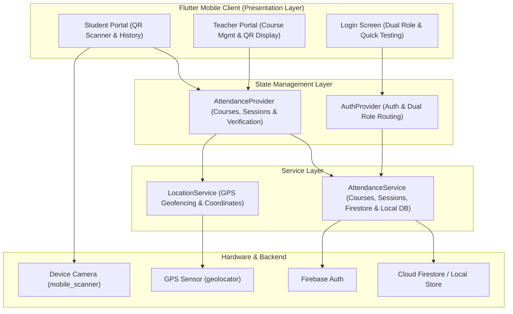
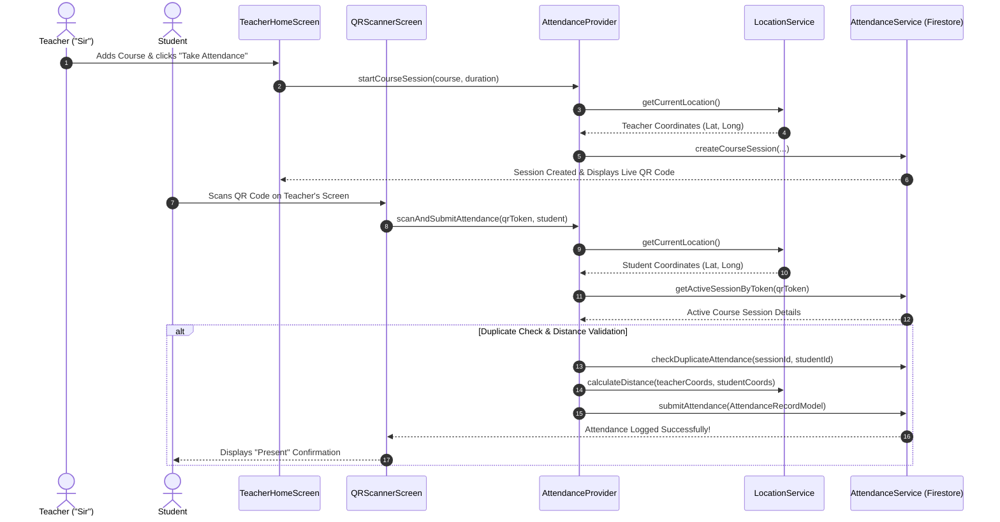
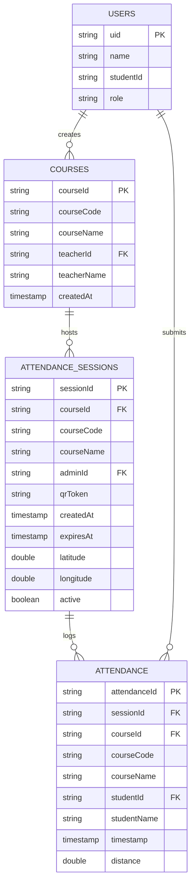

<div align="center">

  # 🎓 TrackAttendance: Course & Attendance System
  **A location-verified course & attendance management solution built with Flutter, Firebase, and Provider.**

  [](https://flutter.dev)
  [](https://dart.dev)
  [](https://firebase.google.com)
  [](https://m3.material.io)
  [](https://github.com/ahmadamin5112004-ship-it/attendance-system)

</div>

---

## 📌 Overview

**TrackAttendance** is an enterprise-grade university mobile application designed to manage courses and streamline attendance logging. It provides dual portals for **Faculty/Teachers ("Sir")** and **Students**:

- **Sir / Teacher Portal**: Create courses, launch location-stamped attendance sessions, display live high-resolution QR codes, and view real-time course attendance logs.
- **Student Portal**: Scan attendance QR codes via camera, pass automatic GPS geofencing and duplicate checks, and review course-wise attendance records.

Built with **Clean Architecture**, **Provider State Management**, and a **Hybrid Database Engine** (Cloud Firestore with local fallback), the app functions out-of-the-box in both online and offline testing environments.

---

## ✨ Key Features

| Feature | Description |
| :--- | :--- |
| **📚 Course Management** | Teachers ("Sir") can create and manage university courses with custom course codes (e.g. `CS-402`) and titles. |
| **📱 On-Screen QR Generator** | Teachers generate live scannable QR codes (`qr_flutter`) bound to their current GPS coordinates and session expiry timers. |
| **🔐 Dual-Role Authentication** | Supports both `teacher` ("Sir") and `student` accounts with automatic portal routing upon login. |
| **📷 Camera QR Scanner** | Students scan active session QR tokens in real time using `mobile_scanner`. |
| **📍 GPS Geofencing** | Validates physical distance between student and teacher coordinates using `Geolocator.distanceBetween()`. |
| **🚫 Duplicate Prevention** | Rejects multiple attendance submissions from the same student for a single active session. |
| **📊 Course Attendance Reports** | Enables teachers to view student attendance rosters per course, and students to view personal attendance history logs. |
| **⚡ Hybrid Database Engine** | Automatically connects to Cloud Firestore when online, with fallback to local state storage when unconfigured. |

---

## 📐 System Architecture & Diagrams

### 1. High-Level Architecture Diagram


---

### 2. UML Course Attendance Sequence Diagram


---

### 3. Entity-Relationship (ER) Diagram


---

## 🗄️ Firestore Database Schema

```
users/{uid}
├── name: string
├── studentId: string (or Faculty ID)
└── role: "student" | "teacher"

courses/{courseId}
├── courseCode: string (e.g. "CS-402")
├── courseName: string (e.g. "Software Engineering")
├── teacherId: string
├── teacherName: string
└── createdAt: timestamp

attendance_sessions/{sessionId}
├── courseId: string
├── courseCode: string
├── courseName: string
├── adminId: string
├── qrToken: string
├── createdAt: timestamp
├── expiresAt: timestamp
├── latitude: number
├── longitude: number
└── active: boolean

attendance/{attendanceId}
├── sessionId: string
├── courseId: string
├── courseCode: string
├── courseName: string
├── studentId: string
├── studentName: string
├── timestamp: timestamp
└── distance: number
```

---

## 📁 Project Architecture

```
lib/
  ├── main.dart                 # App initialization, Material 3 dark theme, & Providers
  ├── models/                   # Strongly-typed data models & serialization
  │     ├── user_model.dart
  │     ├── course_model.dart
  │     ├── attendance_session_model.dart
  │     └── attendance_record_model.dart
  ├── services/                 # Firebase Firestore, Auth, & Location services
  │     ├── firebase_service.dart
  │     └── location_service.dart
  ├── providers/                # State management & reactive business logic
  │     ├── auth_provider.dart
  │     └── attendance_provider.dart
  ├── widgets/                  # Reusable UI components
  │     ├── custom_button.dart
  │     └── info_card.dart
  └── screens/                  # Dual-Role Application Screens
        ├── login_screen.dart         # Dual-role authentication & quick testing
        ├── teacher_home_screen.dart # Sir/Teacher portal for courses & QR generation
        ├── home_screen.dart         # Student dashboard
        ├── qr_scanner_screen.dart   # Camera QR scanner & geofencing validation
        └── history_screen.dart      # Student attendance history logs
```

---

## 🚀 Getting Started & Installation

### Option 1: Direct Release APK Installation (Recommended)
Download and install the compiled Android release binary directly:
👉 **[Download Release APK](file:///Users/ahmadamin/attendance%20system/build/app/outputs/flutter-apk/app-release.apk)**

### Option 2: Running from Source
1. **Clone the repository:**
   ```bash
   git clone https://github.com/ahmadamin5112004-ship-it/attendance-system.git
   cd attendance-system
   ```
2. **Install dependencies:**
   ```bash
   flutter pub get
   ```
3. **Run on connected device / emulator:**
   ```bash
   flutter run
   ```

### ⚡ Quick 1-Click Testing Portals
On the login screen, click either:
- **Log in as Sir / Teacher (Add Course & QR)**: Access Sir's dashboard to add courses, launch sessions, and generate live QR codes.
- **Log in as Student (Scan & Mark Attendance)**: Access Student portal to scan QR codes and review attendance history.

---

## 👥 Contributors

| Contributor Name | Student ID |
| :--- | :--- |
| **Ahmad Amin** | `2022831044` |
| **Akash Talukder** | `2023831016` |
| **Shakhawat Hossain Saikat** | `2023831008` |
