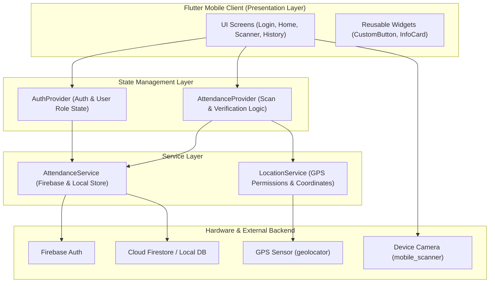
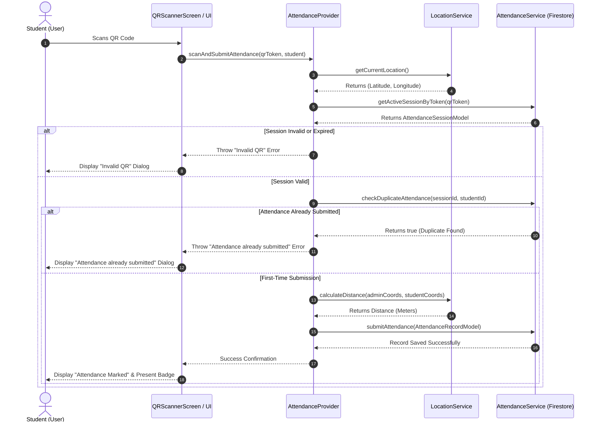
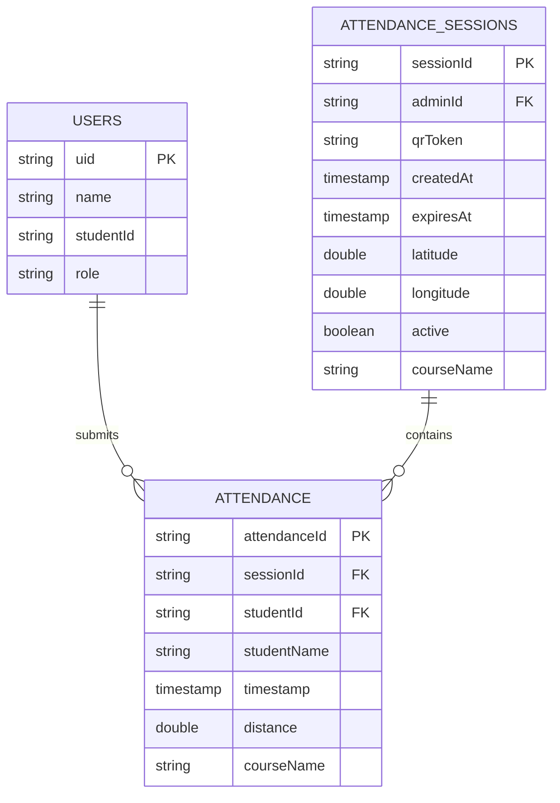

<div align="center">

  # 🎓 Student Attendance Tracking System
  **An advanced, location-verified attendance solution built with Flutter, Firebase, and Provider.**

  [](https://flutter.dev)
  [](https://dart.dev)
  [](https://firebase.google.com)
  [](https://m3.material.io)
  [](https://github.com/ahmadamin5112004-ship-it/attendance-system/releases/tag/v1.0.1)

</div>

---

## 📌 Overview

**TrackAttendance** is a production-ready mobile application designed to streamline student attendance logging for university courses. By combining **real-time QR code recognition** with **GPS location geofencing**, the system ensures that attendance can only be logged by physically present students during active session windows.

Built with **Clean Architecture**, **State Management via Provider**, and a **Hybrid Firebase / Local Fallback Database Engine**, the app runs out-of-the-box on any mobile device.

---

## ✨ Key Features

| Feature | Description |
| :--- | :--- |
| **🔐 Role-Based Auth** | Authenticates students via Firebase Auth and verifies `users/{uid}` database records to reject non-student roles. |
| **📷 Camera QR Scanner** | Scans and extracts active attendance session tokens in real time using `mobile_scanner`. |
| **📍 GPS Geofencing** | Computes the physical distance (in meters) between student and instructor coordinates using `Geolocator.distanceBetween()`. |
| **🚫 Duplicate Prevention** | Checks prior submissions for `sessionId` and `studentId` to prevent duplicate attendance entries. |
| **📊 Attendance Logs** | Provides student history displaying course names, formatted timestamps, status badges (**Present**), and distance metrics. |
| **⚡ Hybrid Database Engine** | Seamlessly connects to Firebase Cloud Firestore when online, with automated fallback to local state storage when unconfigured. |

---

## 📐 System Architecture & UML Diagrams

### 1. High-Level Architecture Diagram


---

### 2. UML Attendance Verification Sequence Diagram


---

### 3. Entity-Relationship (ER) Diagram


---

## 🗄️ Firestore Database Structure

```
users/{uid}
├── name: string
├── studentId: string
└── role: "student"

attendance_sessions/{sessionId}
├── adminId: string
├── qrToken: string
├── createdAt: timestamp
├── expiresAt: timestamp
├── latitude: number
├── longitude: number
├── active: boolean
└── courseName: string (optional)

attendance/{attendanceId}
├── sessionId: string
├── studentId: string
├── studentName: string
├── timestamp: timestamp
├── distance: number
└── courseName: string (optional)
```

---

## 📁 Project Architecture

```
lib/
  ├── main.dart             # App initialization, Material 3 theme, and Providers
  ├── models/               # Strongly-typed data models & serialization
  │     ├── user_model.dart
  │     ├── attendance_session_model.dart
  │     └── attendance_record_model.dart
  ├── services/             # Firebase Firestore, Auth, and GPS Geolocator services
  │     ├── firebase_service.dart
  │     └── location_service.dart
  ├── providers/            # State management & reactive business logic
  │     ├── auth_provider.dart
  │     └── attendance_provider.dart
  ├── widgets/              # Reusable UI components
  │     ├── custom_button.dart
  │     └── info_card.dart
  └── screens/              # Application views
        ├── login_screen.dart
        ├── home_screen.dart
        ├── qr_scanner_screen.dart
        └── history_screen.dart
```

---

## 🚀 Getting Started & Installation

### Option 1: Direct APK Installation (Recommended)
Download and install the compiled Android release binary:
👉 **[Download APK Release (v1.0.1)](https://github.com/ahmadamin5112004-ship-it/attendance-system/releases/tag/v1.0.1)**

### Option 2: Running from Source
1. **Clone the repository:**
   ```bash
   git clone https://github.com/ahmadamin5112004-ship-it/attendance-system.git
   cd attendance-system
   ```
2. **Install dependencies:**
   ```bash
   flutter pub get
   ```
3. **Run on a device or emulator:**
   ```bash
   flutter run
   ```

---

## 👥 Contributors

| Contributor Name | Student ID |
| :--- | :--- |
| **Ahmad Amin** | `2022831044` |
| **Akash Talukder** | `2023831016` |
| **Shakhawat Hossain Saikat** | `2023831008` |

---

